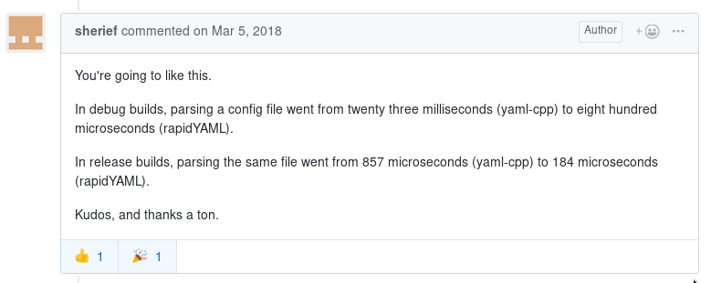

# Rapid YAML
[](https://github.com/biojppm/rapidyaml/blob/master/LICENSE.txt)
[](https://travis-ci.org/biojppm/rapidyaml)
[](https://ci.appveyor.com/project/biojppm/rapidyaml)
[](https://coveralls.io/github/biojppm/rapidyaml)
[](https://codecov.io/gh/biojppm/rapidyaml)
[](https://lgtm.com/projects/g/biojppm/rapidyaml/alerts/)
[](https://lgtm.com/projects/g/biojppm/rapidyaml/context:cpp)


Or ryml, for short. ryml is a library to parse and emit YAML, and do it fast.

ryml parses the source buffer in place, and the resulting tree holds only
sub-ranges of the source buffer. No string copies or duplications are done, and
no virtual functions are used. Serialization happens only when the user wants
it to happen, so internally the data tree representation has no knowledge of
types. The resulting tree is easy and fast to iterate through and change.

ryml can use custom memory allocators, and is made exception-agnostic via a
custom error handler callback.

ryml does not depend on the STL, but can interact with it via `#include
<ryml_std.hpp>`.

ryml is written in C++11, and is known to compile with:
* Visual Studio 2015 and later
* clang++ 3.9 and later
* g++ 5 and later


## Quick start

You can have your cake and eat it too: being rapid doesn't mean being
unpractical! ryml was written with easy usage in mind, and comes with a two level
API for accessing and traversing the data tree: a low-level index-based API
and a higher level wrapping it via a ``NodeRef`` class. The examples in this
section are using the high-level ``NodeRef``.

Parsing from source:
```c++
#include <ryml.hpp>
#include <iostream> // not needed by ryml, just for these examples
int main()
{
    char src[] = "{foo: 1}"; // needs to be writable; will be modified in place
    ryml::Tree tree = ryml::parse(src); // there are also overloads for reusing the tree
    ryml::NodeRef node = tree["foo"]; // get a reference to the "foo" node

    std::cout << node.key() << "\n"; // "foo"
    std::cout << node.val() << "\n"; // "1"

    // deserializing:
    int foo;
    node >> foo; // now foo == 1
}
```

It is also possible to parse constant buffers, but before parsing ryml will
copy these over to an arena buffer in the tree object, and modify those while
parsing:
```c++
// "{foo: 1}" is a read-only buffer; it will be copied to the tree's arena
auto tree = ryml::parse("{foo: 1}");
```

`node.key()` and `node.val()` return an object of type `c4::csubstr` (the
name comes from constant substring) which is a read-only string view, with
some more methods that make it practical to use. There's also a writable
`c4::substr` string view, which in fact is used heavily by ryml to transform
YAML blocks and scalars during parsing. You can browse these classes
here: [c4/substr.hpp](https://github.com/biojppm/c4core/src/c4/substr.hpp).


To create a tree programatically:
```c++
ryml::Tree tree;
NodeRef r = tree.rootref();

r |= ryml::MAP;  // this is needed to make the root a map

r["foo"] = "1"; // ryml works only with strings.
// Note that the tree will be __pointing__ at the
// strings "foo" and "1" used here. You need
// to make sure they have at least the same
// lifetime as the tree.

auto s = r["seq"]; // does not change the tree until s is written to.
s |= ryml::SEQ;
s.append_child() = "bar0"; // value of this child is now __pointing__ at "bar0"
s.append_child() = "bar1";
s.append_child() = "bar2";

// emit to stdout (can also emit to FILE* or ryml::span)
emit(tree); // prints the following:
            // foo: 1
            // seq:
            //  - bar0
            //  - bar1
            //  - bar2

// serializing: using operator<< instead of operator=
// will make the tree serialize the value into a char
// arena inside the tree. This arena can be reserved at will.
int ch3 = 33, ch4 = 44;
s.append_child() << ch3;
s.append_child() << ch4;

{
    std::string tmp = "child5";
    s.append_child() << tmp;
    // now tmp can go safely out of scope, as it was
    // serialized to the tree's internal string arena
}

emit(tree); // now prints the following:
            // foo: 1
            // seq:
            //  - bar0
            //  - bar1
            //  - bar2
            //  - 33
            //  - 44
            //  - child5

// to serialize keys:
r.append_child() << ryml::key(66) << 7;

emit(tree); // now prints the following:
            // foo: 1
            // seq:
            //  - bar0
            //  - bar1
            //  - bar2
            //  - 33
            //  - 44
            //  - child5
            // 66: 7
}
```


To iterate over children:
```c++
for(auto c : node.children())
{
    std::cout << c.key() << "---" << c.val() << "\n";
}
```

To iterate over siblings:
```c++
for(auto c : node.siblings())
{
    std::cout << c.key() << "---" << c.val() << "\n";
}
```

For container-type nodes, the square-bracket operator can
be used either with integers (both for sequence and map nodes) or with
strings (only for map nodes):
```c++
ryml::Tree = ryml::parse("[a, b, {c: 0, d: 1}]");
ryml::NodeRef root = tree.rootref();
std::cout << root[0].val() << "\n"; // "a"
std::cout << root[1].val() << "\n"; // "b"
std::cout << root[2][ 0 ].val() << "\n"; // "0" // index-based
std::cout << root[2]["c"].val() << "\n"; // "0" // string-based
std::cout << root[2][ 1 ].val() << "\n"; // "1" // index-based
std::cout << root[2]["d"].val() << "\n"; // "1" // string-based
```

What about `NodeRef`? Before we look at it, let's take a moment to consider
when a non-existing key or index is requested via the square-bracket
operator. Unlike with `std::map`, this operator does *not* modify the tree.
Instead you get a seed `NodeRef`, and only if this seed-state ref is written
to will the tree be modified, by creating a node with the seed name or index.
To allow for this, `NodeRef` is a simple structure with a declaration like:

```c++
class NodeRef
{
    // a pointer to the node tree
    Tree * m_tree; 
    
    // either the (tree-scoped) index of an existing node or the (node-scoped) index of a seed state
    size_t m_node_or_seed_id;
    
    // the key name of a seed state
    const char* m_seed_name;

public:

    bool valid() { return m_node_id != npos && m_node_name == nullptr; }

    // forward all calls to m_tree. For example:
    csubstr val() const { assert(valid()); return m_tree->val(m_node_or_seed_id); }
    void set_val(csubstr v) { if(!valid()) {/*create node in tree*/;} m_tree->set_val(m_node_or_seed_id, v); }
    // etc
};
```

So using this high-level API is not going to cost a lot more than the less
practical low level API.


### STL interoperation

ryml does not require use of the STL. Use of STL is opt-in: you need to
`#include` the proper ryml header. Having done that, you can serialize them
with a single step. For example:

```c++
#include <ryml_std.hpp>
int main()
{
    std::map< std::string, int > m({{"foo", 1}, {"bar", 2}});
    ryml::Tree t;
    t.rootref() << m;
    
    emit(t);
    // foo: 1
    // bar: 2
    
    t["foo"] << 10;
    t["bar"] << 20;
    
    m.clear();
    t.rootref() >> m;
    
    std::cout << m["foo"] << "\n"; // 10
    std::cout << m["bar"] << "\n"; // 20
}
```

The `<ryml_std.hpp>` header includes every default std type implementation
for ryml. You can include just a specific header if you are interested only
in a particular container; these headers are located under a specific
directory in the source folder [c4/yml/std](src/c4/yml/std).

These headers also showcase how to implement your custom type. See for
example [the map implementation](src/c4/yml/std/map.hpp).

### Custom types

ryml comes stocked with code to serialize the basic intrinsic types (integers
and floating points). For types other than these, you need to instruct ryml
how to serialize your type.

There are two distinct categories of types when serializing to a YAML tree:

* The type is serializable to a string, and it will be a leaf node in
  the tree. For these, overload the `to_str()/from_str()` functions. An example
  can be seen in
  the [the `std::string` serialization code](src/c4/yml/std/string.hpp).

* The type requires child nodes (it is either a sequence or map).
  For these, overload the `write()/read()` functions. Examples can be seen in
  the serialization of [`std::vector`](src/c4/yml/std/vector.hpp)
  or [`std::map`](src/c4/yml/std/map.hpp).
  
It is important to overload these functions in the namespace where the type
you're serializing was defined, to
harness [C++'s ADL rules](http://en.cppreference.com/w/cpp/language/adl).


### Low-level API

... describe index-based API of the tree.


### Custom allocation

... describe [custom allocation callbacks](src/c4/yml/common.hpp)

### Custom error handling

... describe [the custom error handler callback](src/c4/yml/common.hpp)


## YAML standard conformance

ryml is under active development, but is close to feature complete. UTF8 has
not yet been tested.

The following core features are tested:
* mappings
* sequences
* complex keys
* literal blocks
* quoted scalars
* tags
* anchors and references

Of course, there are some dark corners in YAML, and there certainly can
appear many cases which YAML fails to parse. So we welcome
your bug reports or pull requests!

I am currently working on integrating (and fixing) the ~300 cases in the YAML
test suite.


## Rapid? How rapid is it?

There are already some very impressive figures: compared against
[yaml-cpp](https://github.com/jbeder/yaml-cpp) in a
[particular test case](https://github.com/biojppm/rapidyaml/issues/1#issuecomment-370300625),
**rapidyaml was ~5x faster (~20% CPU time)** in Release builds and **~30x faster
(~3.5% CPU time)** in Debug builds:

[](https://github.com/biojppm/rapidyaml/issues/1#issuecomment-370300625)

When I finish work on the test suite, I will get down to write some
comparison benchmarks.


## Alternative libraries

Why this library? Because none of the existing libraries was quite what I
wanted. There are two C/C++ libraries that I know of:

* [libyaml](https://github.com/yaml/libyaml)
* [yaml-cpp](https://github.com/jbeder/yaml-cpp)

The standard [libyaml](https://github.com/yaml/libyaml) is a bare C
library. It does not create a representation of the data tree, so it can't
qualify as practical. My initial idea was to wrap parsing and emitting
around libyaml, but to my surprise I found out it makes heavy use of
allocations and string duplications when parsing.

[yaml-cpp](https://github.com/jbeder/yaml-cpp) is full of functionality and
is very ably maintained, but is heavy on the use of streams, exceptions and
string copies and allocations.

For heavy or low-latency use cases, parsing in place and using non-owning
strings is of central importance. Hence this rapid YAML library, which
bridges the gap from efficiency to usability. This library takes inspiration
from RapidXML and RapidJSON.

## License

ryml is permissively licensed under the [MIT license](LICENSE.txt).

